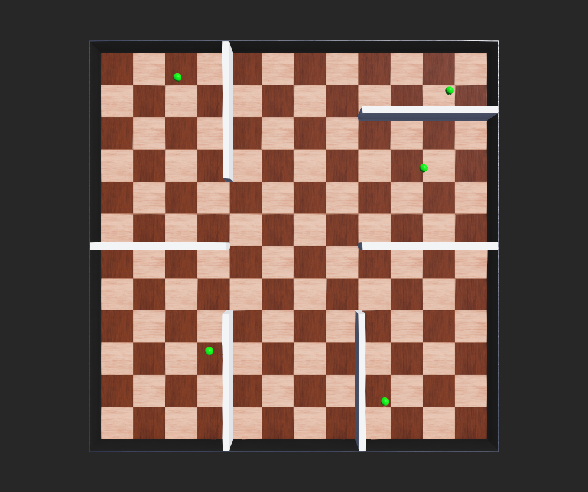
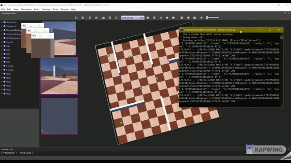
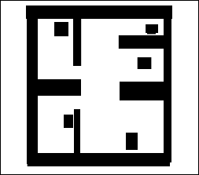
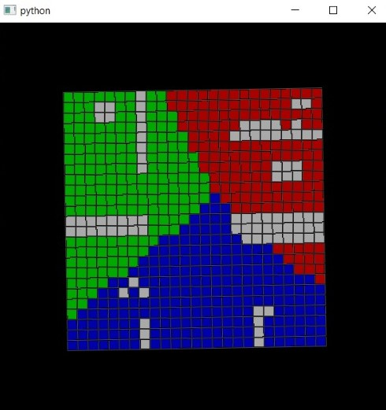
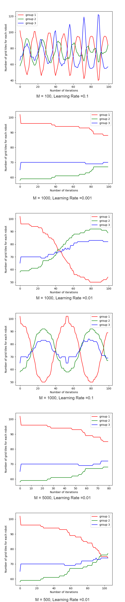
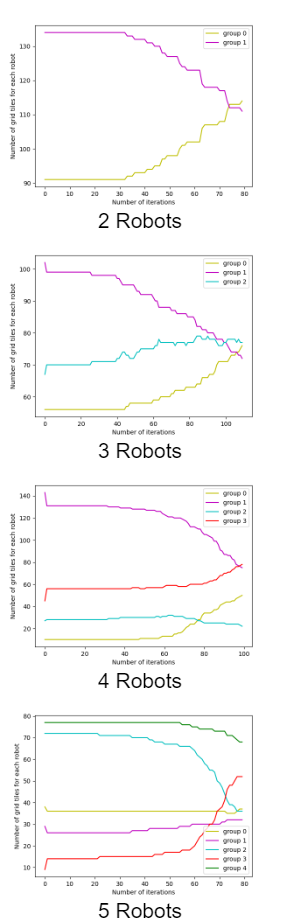
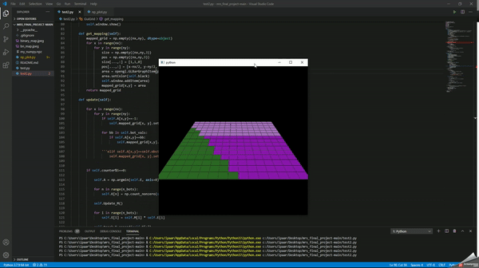
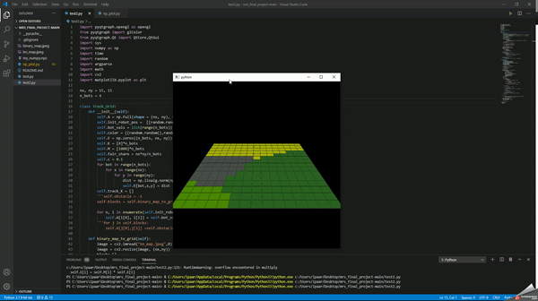
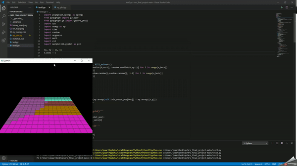

# Multi-Robot Exploration and Area Division
**Idea:** Given a area to explore and find objects, divide the work/area equallly among the agents and share the found objects using Cooperative Perceptional Messages as common knowledge for all the agents in the field.

The project can be divided into Exploration and Area Division part.

## Acknowledgement
The area division part of this project is based in the following paper:

Kapoutsis, Athanasios & Chatzichristofis, Savvas & Kosmatopoulos, Elias. (2017). DARP: Divide Areas Algorithm for Optimal Multi-Robot Coverage Path Planning. Journal of Intelligent & Robotic Systems. 86. 10.1007/s10846-016-0461-x. from https://www.researchgate.net/publication/312671859_DARP_Divide_Areas_Algorithm_for_Optimal_Multi-Robot_Coverage_Path_Planning.

The area division code was written based on the mathematical modelling from the above mentioned paper.

## Requirements
  * Python 3.6
  * Webots simulator
  * OpenCV and its dependencies
  * Flask, Requests
  * Matplotlib 
  * Pygame, PyQt and supporting libraries.

## Exploration
The agents explore and find the described object in the environment in this section using webots simulator.
### Webots Simulator

Webots simulator has been chosen after playing around with multiple simulators inclusing ROS. This provides a easy to start interface and also provides various robots to play around with in it's library. We have chosen a epuck which has a camera and ultrasonic sensors to avoid collisions.  
The controller code is easy to write and the same code can be given to all the bots in the environment. The figure shows us the environment that is designed for the project. The simple code for the robot controller can be found here. 

### Object Detection
Each of the robot is equipped with a basic contour detection code. This is made very simple by just detecting the contour but we can also use advanced object detectors and make our detection far better. Green spheres are placed around the environment as shown in the image above and our robots can detect this using the following detection module.

    def find_object(image):
        hsv = cv2.cvtColor(image, cv2.COLOR_BGR2HSV)
        mask = cv2.inRange(hsv, (36, 25, 25), (70, 255,255))
        ret,thresh = cv2.threshold(mask,127,255,1)
        contours,h = cv2.findContours(thresh,1,2)
        for cnt in contours:
            approx = cv2.approxPolyDP(cnt,0.01*cv2.arcLength(cnt,True),True)
            if len(approx) > 15:
                (x,y),radius = cv2.minEnclosingCircle(cnt)
                center = (int(x),int(y))
                radius = int(radius)
                cv2.circle(image,center,radius,(255,0,0),4)
                return (True, radius)
        
        return (False,0)

This module also returns the radius of the object to determine the sieze and the distance of the object from the robot so that we can ignore the duplicate counts by different robots.

### Cooperative Perception Messages
The idea of using CPMs is loosly based on the V2V communication in cars. CPMs are basically messages which is shared among multiple agents but also shares it's perceptional information. Sometimes, it semantic information or just object detection information. This is particularly useful in roads to share blindspots, cooperative signals among multiple cars. 

In this project, a version of it is implemented using a Flask server and different agents share information of the things they found and the common knowledge is available to all the agents in the environment.

  

The above image shows when an object is detected by a robot, it shares the info of the object and all the robots are able to access the same. This shows we can use CPMs to share information among agents for effective communication during exploration tasks.

### How to Run
* Select the respective bot from webots and use the given code as the controller code for each of the agent.
* Run the server by using this code in a seperate terminal and please make sure the host is reachable by using the correct port number in bots as well as the server.
* Once the program is started, you can see the CPMs in the server from different robots.

## Area Division
The area for exploration of the robots should be divided optimally for each robot based on their inital location. For this area division problem, the algorithm from the above mentioned paper is used. It used gradient descent to find the most optimal division of area among the agents.

### PyQt and Pygame Interface

While the same can be done using webots, Python libraries like PyQt gave more control and was easier to implment the algorithm.
For this, we take the top-down or birds eye view of our created environment in webots and convert it into a binary map. This binary map contains white in areas where the robot can move and areas with black are blocked and not available. This binary image is taken as the input for the pygame's grid layout environment and this is mapped accordingly to form blocks and free areas in the environment. The colors shown in the picture are based on Voronoi's diagram closed area division.

<table>
<tr>

<td>Binary Image from webots Bird's eye view
</td>

<td>Respective PyQt simulation from  binary image </td>
</tr>
</table>

### Divide Areas Based on Robots Initial Positions (DARP)
The DARP algorithm is responsible for optimal area division among the robots. 
The algorithm goes as follows:
*Intialize Weights M for each bot and intialize fair share value for the bots grid/number of bots*
* *Step 1:* Intialize Evaluation matrix E_r for each robot with distance values for each grid.  

      dist = np.linalg.norm(np.array(self.init_robot_pos[bot]) - np.array((x,y)))
      E[bot,x,y] = dist
* *Step 2:* For each grid box, find the least robot with the shortest distance and assign the box to the respective robot. This matrix is called Assignment matrix A.  

      A = np.argmin(E, axis=0)

* *Step 3:* Count the number of boxes assigned for each robot and store it in a K matrix (contains number of boxes for each bot).  

      for n in range(n_bots):
          K[n] = np.count_nonzero(A == bot_vals[n])

* *Step 4:* Robot weightage M was intialized with a value and it should be updated in accordance to fair share. K-fair share gives the error and that is used to calculate the new M value with a learning constant c.  

        for i in range(n_bots):
            M[i] = M[i] + c*(K[i] - fair_share)
* *Steps 5:* Once the weights M are calculated, it is then used to calculate the E matrix for each robot.  

            for i in range(n_bots):
                E[i] = M[i] * E[i]
* *Step 6:* The *steps 2- 6* are repeated until convergence.

 The above process is called cyclic gradient descent. For more details, please refer to section 6 of the mentioned paper.

The parameters like Initial Weightage M and learning constant c decided based analysis discussed in the next section.

### Analysis and Parameter Tuning
 
The following sections discuss various analysis done to find the optimal paramters for different bot and grid settings.    

**Optimisation on number of robots**  

As the number of robots increase, since our algorithm is not the most optimal one and it can settle for a sub-optimal solution, the algorithm cannot converge as easily as when having less number of robots. We also have to tune the Hyperparamerts such as *M* and the *learning rate* to accomodate the new number of robots that we have. The figure shows that as we increase the number of robots in the grid of same size it is really hard for our algorithm to find a global optimum. The figure shows the experiments and results performed on these metrics.

**Computational Complexity**  

The memory required to run the algorithm can be easily calculated by the grid size and the number of robots present in the environment. The Complexity of the algorithm is basically n_r x n where n_r is the number of robots and n is the grid size of the environment. This also means that it has a linear complexity on by the Big 0 notion and as the number of robots increase, the time taken to converge by the gradient descent algorithm also increases linearly. This has been clearly analysed and referenced in the paper.

**Initial Weightage *M* and Learning Constant *c* Tuning**  

The general trend is that as we decrease the learning rate the from range [0.1, 0.01, 0.001, 0.0001] the algorithm increasingly gets slower and slower and also, high of possibility getting stuck at global minima. On the other hand the the initial weightage for each of the robot also affects the performance of the robot in a interesting way making the optimization unstable if we decrease it and does not let the grid converge if it is too high.   

Also, we have noticed that the increase in the increase in number of robots n_r affects the system very much and we have to find new parameters by tuning to it accordingly. The below image how the system gets affected for different M and learning constant. After a lot of observation we were able to zero down on a good aprroximation of M=500 and learning rate = 0.01 for n_r = 3 as you can see it in the result section figure the convergence is as perfect in final graph. 

## Results

*Run cyclic_GD_voronoi.py to run the program and modify the number of robots n_bots as required.*

As you can see in the following gifs, the algorithm we implemented works as intended and we should also note that the solutions obtained are still sub-optimal. As discussed earlier, we can see the algorithm performs better for less number of robots and convergence is affected by the grid size as well as number of robots.

<table>

<tr>
 <td> 2 Robots </td>
 <td></td>

<td>
  
  
  
  
</td>
</tr>

</table> 

But still the results are pretty impressive for a crude cyclic gradient descent implementation.  

Full Demo Here: https://youtu.be/A0Eaze0tGNw
