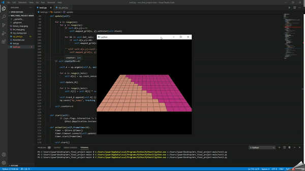

# Multi-Robot Exploration and Area Division
**Idea:** Given a area to explore and find objects, divide the work/area equallly among the agents and share the found objects using Cooperative Perceptional Messages as common knowledge for all the agents in the field.

The project can be divided into Exploration and Area Division part.

## Acknowledgement
The area division part of this project is based in the following paper:

Kapoutsis, Athanasios & Chatzichristofis, Savvas & Kosmatopoulos, Elias. (2017). DARP: Divide Areas Algorithm for Optimal Multi-Robot Coverage Path Planning. Journal of Intelligent & Robotic Systems. 86. 10.1007/s10846-016-0461-x. from https://www.researchgate.net/publication/312671859_DARP_Divide_Areas_Algorithm_for_Optimal_Multi-Robot_Coverage_Path_Planning.

The area division code was written based on the mathematical modelling from the above mentioned paper.

## Requirements
  * Python 3.6
  * Webots simulator
  * OpenCV library and its dependencies
  * Flask Library
  * Matplotlib library
  * Requests library
  * Controller library for Webots

## Exploration
### Webots Simulator

Webots simulator has been chosen after playing around with multiple simulators inclusing ROS. This provides a easy to start interface and also provides various robots to play around with in it's library. We have chosen a epuck which has a camera and ultrasonic sensors to avoid collisions. The controller code is easy to write and the same code can be given to all the bots in the environment. The figure shows us the environment that is designed for the project. The simple code for the robot controller can be found here. 

### Object Detection
Each of the robot is equipped with a basic contour detection code. This is made very simple by just detecting the contour but we can also use advanced object detectors and make our detection far better. Green spheres are placed around the environment as shown in the image above and our robots can detect this using the following detection module.

    def find_object(image):
        hsv = cv2.cvtColor(image, cv2.COLOR_BGR2HSV)
        mask = cv2.inRange(hsv, (36, 25, 25), (70, 255,255))
        ret,thresh = cv2.threshold(mask,127,255,1)
        contours,h = cv2.findContours(thresh,1,2)
        for cnt in contours:
            approx = cv2.approxPolyDP(cnt,0.01*cv2.arcLength(cnt,True),True)
            if len(approx) > 15:
                (x,y),radius = cv2.minEnclosingCircle(cnt)
                center = (int(x),int(y))
                radius = int(radius)
                cv2.circle(image,center,radius,(255,0,0),4)
                return (True, radius)
        
        return (False,0)

This module also returns the radius of the object to determine the sieze and the distance of the object from the robot so that we can ignore the duplicate counts by different robots.

### Cooperative Perception Messages
The idea of using CPMs is loosly based on the V2V communication in cars. CPMs are basically messages which is shared among multiple agents but also shares it's perceptional information. Sometimes, it semantic information or just object detection information. This is particularly useful in roads to share blindspots, cooperative signals among multiple cars. 

In this project, a version of it is implemented using a Flask server and different agents share information of the things they found and the common knowledge is available to all the agents in the environment.

  

The above image shows when an object is detected by a robot, it shares the info of the object and all the robots are able to access the same. This shows we can use CPMs to share information among agents for effective communication during exploration tasks.

### How to Run
* Select the respective bot from webots and use the given code as the controller code for each of the agent.
* Run the server by using this code in a seperate terminal and please make sure the host is reachable by using the correct port number in bots as well as the server.
* Once the program is started, you can see the CPMs in the server from different robots.

## Area Division

  

  

 

### Cyclic Gradient Descent

### Parameter Tuning

  

  

  

  

## Results

  

Demo Here: https://youtu.be/A0Eaze0tGNw
